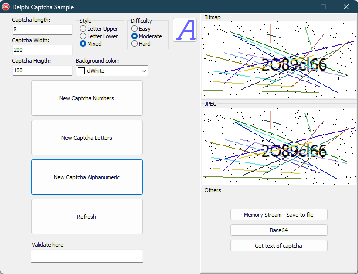

# Delphi-Captcha-Generator

### Description

Delphi Captcha generator is an interface that allows you to generate an image in TBitmap format based on the configuration defined when creating the object.

It is easy to use, and you can add it to your project in routines that require more critical validation before executing automated processes, password validation, and Turing tests (human-machine interaction).

The interface can return the generated image in various formats:

TMemoryStream
TBitmap
TJPEG
Base64 (bitmap format)
The text generated in the captcha.

### How to use 

To use, add it to your project's Search Path or include the units from the 'src' folder, or add the 'src' folder to Delphi's Library Path.

After that, simply declare the 'Captcha.Intf' unit in the 'uses' clause.

You can define a global or local variable to perform the process

Defining an easily understandable captcha with a length of 6 characters, including both uppercase and lowercase letters.

```Delphi
var 
  LBitmap: TBitmap; 
  LCaptcha: ICaptcha;
begin
  
  LBitmap:=	FCaptcha.SetWidth(200)
				.SetLegth(6)
				.SetHeigth(80)
				.Font('Tahome', 12, clBlack)
				.Easy
				.Letters
				.LetterMixed
				.Build.ToBitmap;
  Image1.Picture.Assign(LBitmap);
  
  Lbitmap.free;
end;
```

One line example without variables to ICaptcha;

```Delphi

      LStream:= TCaptchaUtils
                 .New
                   .Alphanumeric
                   .SetHeigth(80)
                   .SetWidth(200)
                   .SetLength(10)
                   .LetterMixed
                   .Moderate
                   .Build
                   .ToStream;
```

You can explore additional configuration options in the project located in the 'sample' folder.

<p align="center">

</p>
<h5 align="center">


### Avoiding memory leaks 

Attention: When using ToBitmap, ToStream, ToJPEG, you are responsible for releasing the memory object.

### Compatibility

Delphi XE to 12.0 (Perhaps, it might be compatible with versions older than XE.)

VCL only

<p align="center">

</p>
<h5 align="center">

Made with :heart: for Delphi
</h5>